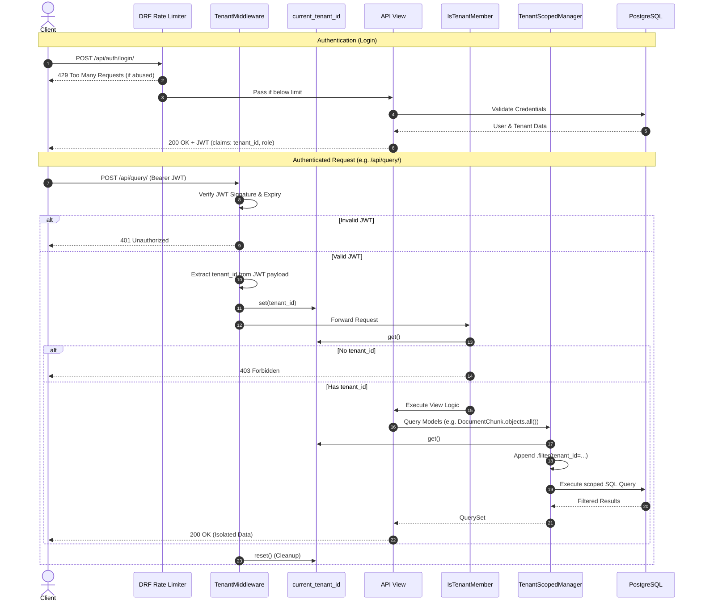

# Authentication & Tenant Isolation Flow

This sequence diagram illustrates the lifecycle of a request in DocuMind, highlighting how the JWT is validated, how the tenant ID is extracted into a thread-safe context variable, and how the ORM uses this to enforce Row-Level Security via the `TenantScopedManager`.

