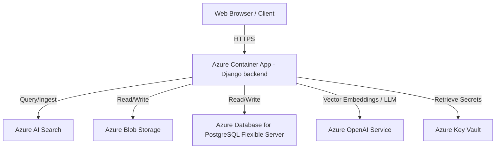

# Azure Infrastructure-as-Code (IaC) Plan

This directory contains the Bicep template (`main.bicep`) to provision all required Azure resources for the DocuMind production system.

## Proposed Resource Architecture

The system is deployed using a secure, standard Hub-and-Spoke model or a simple flat resource group architecture depending on network topology. Below are the resource mappings:



## Azure Services Overview & Quota Gotchas

### 1. Azure OpenAI Service
*   **Models Deployed**:
    *   `text-embedding-3-large` (used for generating 1536-dimensional or 3072-dimensional document/query vectors)
    *   `gpt-4o` (used for generating RAG responses and agent coordination)
*   **Gotchas & Quotas**:
    *   **Regional Availability**: `gpt-4o` and `text-embedding-3-large` are not available in all Azure regions. Recommend deploying to **East US**, **Sweden Central**, or **West US 3** to guarantee both models are available in the same subscription area.
    *   **TPM (Tokens Per Minute)**: Default TPM limits on new subscriptions might be low. Verify that your subscription has at least 120k TPM quota for `text-embedding-3-large` and 40k TPM for `gpt-4o`.
    *   **Cognitive Services Multi-Service accounts** vs individual OpenAI accounts: Ensure you have permissions to create Cognitive Services accounts (`Microsoft.CognitiveServices/accounts`).

### 2. Azure AI Search
*   **Sku Selected**: `standard` (S1)
*   **Gotchas & Quotas**:
    *   **Tier Constraints**: The **Free** and **Basic** tiers **DO NOT** support the Semantic Ranker (semantic search capability), which is necessary for production-grade RAG retrieval re-ranking. You must use `Standard` (S1) or higher.
    *   **Semantic Search Billing**: Semantic Search is billed as an add-on. Make sure it is enabled on the resource (controlled in the Bicep file with `semanticSearch: 'free'` or `'standard'`). The `'free'` tier allows up to 1,000 queries per month.

### 3. Azure Database for PostgreSQL Flexible Server
*   **Sku Selected**: `Standard_D2s_v3` (General Purpose, 2 vCPUs, 8 GB RAM)
*   **Gotchas & Quotas**:
    *   **Burstable Tier**: Avoid Burstable SKUs (like `Standard_B1ms`) in production because they suffer from IOPS throttling under indexing/search loads.
    *   **pgvector Extension**: The `vector` (pgvector) extension is required for storing chunk embeddings in PostgreSQL if hybrid search runs on both PostgreSQL and Azure AI Search. This extension is pre-installed on Flexible Server. You must load it within the database application by running `CREATE EXTENSION IF NOT EXISTS vector;` in your migrations.
    *   **Firewall Rules**: For Azure Container Apps to communicate with PostgreSQL, you must set the firewall rule `allow-all-azure-ips` (Start/End IP: `0.0.0.0`) or deploy PostgreSQL inside a shared Virtual Network (VNet).

### 4. Azure Container Apps (ACA)
*   **Components**: ACA Environment, Log Analytics Workspace, Container App, Container Registry.
*   **Gotchas & Quotas**:
    *   **Serverless Scaling**: By default, ACA scales from 0 to 10 instances. Scale-to-zero is cost-effective for dev environments but causes cold start delays. For production, keep `minReplicas` set to `1` or higher.
    *   **Docker Container**: Django requires a built image pushed to the Azure Container Registry (ACR). The Bicep template provisions the ACR and deploys a placeholder image (`mcr.microsoft.com/azuredocs/aci-helloworld`) which is replaced by your CI/CD pipeline once the Django Dockerfile is built.

### 5. Azure Key Vault
*   **Sku Selected**: `standard`
*   **Gotchas & Quotas**:
    *   **RBAC vs. Access Policies**: The Bicep template enables `enableRbacAuthorization: true`. This is Microsoft's modern recommendation, allowing you to control secrets access using Azure Active Directory (AAD) roles rather than fragile Key Vault access policies.

### 6. Azure Blob Storage
*   **Sku Selected**: `Standard_LRS` (Locally Redundant Storage) with StorageV2
*   **Gotchas & Quotas**:
    *   **CORS Configuration**: If the frontend directly uploads documents to Blob Storage using SAS tokens, CORS must be configured on the Blob Service properties.
    *   **TLS Requirement**: Enforce `minimumTlsVersion: 'TLS1_2'` for compliance.

---

## Deploying the Bicep Template

Before deploying, ensure you have the Azure CLI and Bicep tools installed:
```powershell
az bicep install
```

### Deployment Steps:
1. Log in to Azure and select your subscription:
   ```bash
   az login
   az account set --subscription "<your-subscription-id>"
   ```
2. Create a Resource Group in a supported region (e.g. `eastus2`):
   ```bash
   az group create --name documind-rg --location eastus2
   ```
3. Run the deployment:
   ```bash
   az deployment group create \
     --resource-group documind-rg \
     --template-file main.bicep \
     --parameters \
       environment=dev \
       pgAdminUsername=documind_admin \
       pgAdminPassword="<your-secure-password-here>"
   ```
